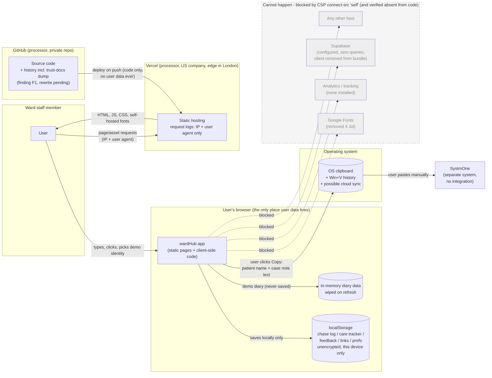
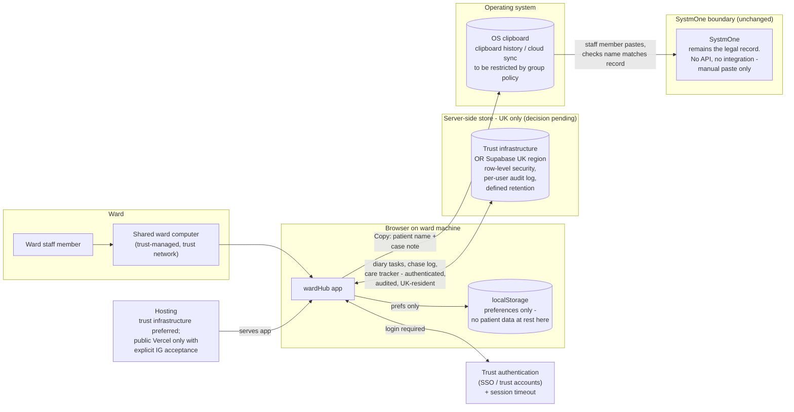

# wardHub data flow diagrams

> Draft - 4 July 2026, prepared for trust review.
>
> Companion to 03a-dpia-draft.md (Step 2.5). Two diagrams: the current public
> demo as it actually behaves after the 4 July fix pass, and the proposed live
> ward deployment. Facts verified against the codebase and live site on
> 4 July 2026 (see 01-data-governance-audit.md).

---

## Diagram 1 - current public demo (Scope A)

### Walkthrough - current demo

There are exactly three flows, and only one of them ever carries anything a
user typed.

1. **Browser to Vercel and back.** The user's browser requests pages and assets;
   Vercel serves static files and logs the request (IP address, user agent) as
   any web host does. No form data, no localStorage content, nothing user-entered
   is ever in these requests, because there is no backend to send it to. Fonts
   are self-hosted, so no request goes to Google.

2. **Inside the browser.** Everything the user enters - demo identity, referral
   chase log, care review tracker, feedback posts, personal links, preferences -
   is written to localStorage on that device and read back on the next visit.
   It never leaves the machine. Logout clears the two patient-identifying stores
   (chase log, care tracker); the GDPR page's "clear my data" wipes everything.
   Demo diary data is held in memory only and disappears on refresh.

3. **The clipboard, by design.** The one deliberate egress. When the user clicks
   a copy button, the case note text (prefixed with the linked patient's name -
   fictional in the demo) goes to the OS clipboard, and the user pastes it into
   SystmOne themselves. There is no integration: wardHub and SystmOne never
   communicate. The clipboard is OS territory - Windows keeps a history (Win+V)
   and can sync to other devices, which is why the DPIA treats this pathway as
   the main risk to manage in live use (DPIA risk B2, hazard HAZ-023).

The greyed-out box is the point IG reviewers usually have to take on trust, but
here it is enforced: the Content Security Policy restricts `connect-src` and
`img-src` to `'self'`, so the browser itself refuses any connection from the app
to any other host. No analytics exists to be blocked; the dormant Supabase
client was removed from the shipped bundle on 4 July. GitHub appears on the
diagram because it holds the source code (and, until the pending history rewrite,
the historical trust-docs dump) - it never sees application user data.

---

## Diagram 2 - proposed live ward deployment (Scope B)

### Walkthrough - proposed live build

The shape stays deliberately similar to the demo - same app, same manual
SystmOne boundary - with three structural changes, each of which is a go-live
condition rather than an option:

1. **Authentication in front of everything.** Trust SSO (or equivalent) with a
   session timeout suited to shared ward machines. The demo's open access does
   not carry over (DPIA measure M1).

2. **Patient data moves off the device.** The chase log, care tracker and diary
   move to a server-side store - trust infrastructure or Supabase on a verified
   UK region - with row-level security, a per-user audit trail and a defined
   retention rule. localStorage is demoted to preferences. This single change
   resolves the two go-live blockers in the hazard log (HAZ-020 chase log lost
   at logout, HAZ-022 diary not shared between devices) and the DPIA's high
   risks B1 and B6 (shared-machine exposure, no audit trail). The choice between
   trust hosting and Supabase UK is the trust's (DPIA measure M2, [TRUST TO
   CONFIRM: IT]).

3. **The SystmOne boundary stays manual.** Copy, paste, check the name. No API,
   no background sync. The pasted note still leads with the patient's name so a
   wrong-record paste is visible at the point of paste (HAZ-017). The clipboard
   residue risk is managed by group policy on clipboard history and cloud sync
   plus in-app guidance (HAZ-023, DPIA measure M3) - the app cannot control the
   OS, so this control belongs to trust IT.

Hosting is drawn as a decision point: patient data should not sit behind public
Vercel without an explicit, documented IG acceptance (DPIA measure M7). Nothing
else changes - there is still no analytics, no tracking, and no third party in
the data path.
