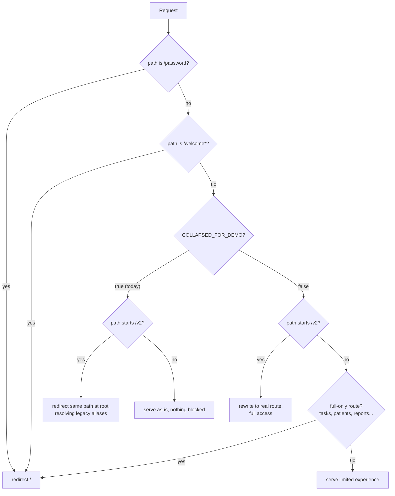
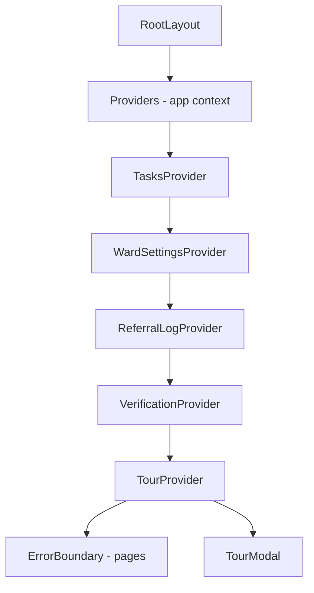

# wardHub architecture

> Rebuild pack, part 1 of 3. Written 4 July 2026 against the live code (not the docs).
> Audience: a trust developer who has never opened this repo. Read this first, then
> 08b (data inventory) and 08c (rebuild options).

## What this is

wardHub is a Next.js 16 single-page-style web app for mental health inpatient wards.
It bundles four things: a link directory, a library of ~64 clinical guides and referral
workflows, a ward task diary with a patient list, and some extras (training quiz,
service eligibility map, printable patient leaflets). Everything runs in the browser.
There is no backend: no API routes, no database queries, no accounts. All content is
compiled into the JavaScript bundle from TypeScript data files, and everything a user
does is held in React state or the browser's localStorage.

That one fact drives every architectural decision below, and it is what makes a
rebuild cheap: the app is a rendering layer over plain data files.

## Stack

| Piece | What | Notes |
|---|---|---|
| Framework | Next.js ^16.1.6, App Router | Every page is a `"use client"` component. No server components doing work, no `src/app/api/` routes |
| Language | TypeScript 5 | |
| Styling | Tailwind CSS 4 + CSS variables in `src/app/globals.css` | NHS colour tokens, 5 visual themes, dark mode |
| Icons | lucide-react, plus emoji in data files | |
| Toasts | sonner | |
| Fonts | Source Sans 3 + Lora, self-hosted via `next/font` | Deliberate: no request to Google at runtime |
| Backend | None | `@supabase/supabase-js` is installed and a client exists, but nothing calls it (see "Data layer") |
| Tests | Jest, 3 suites under `src/__tests__/` | |
| Hosting | Vercel, auto-deploy from GitHub `main` | |

Security headers (including a CSP locked to `'self'`) are set in `next.config.ts`.
Because fonts are self-hosted and there is no backend, the CSP technically enforces
"no data leaves the site".

## Route map

All routes live under `src/app/`. Everything renders inside `MainLayout`
(header, nav, footer) except login and the printable leaflet viewer.

### Core pages

| Route | What it is |
|---|---|
| `/` | Home: quick actions, bookmark wheel carousel, safeguarding hub, today widget |
| `/links` | The link directory (113 links, 16 categories), plus personal links and suggest/report flows |
| `/guides` | Guide index: all 64 guides in 12 categories with search, category and type filters |
| `/guides/[id]` | The unified guide viewer (see "The guide system") |
| `/quiz` | Training quiz, 364 questions, nothing stored |
| `/service-map` | Prototype SVG "town map" of ~109 services with a live eligibility engine |
| `/patient-guides` and `/patient-guides/[id]` | 29 patient-facing MH leaflets, print-oriented |
| `/login` | Demo login: pick ward, then a name from that ward's staff list |
| `/gdpr`, `/faq`, `/intro-guide`, `/feedback`, `/data-sources`, `/dev-panel` | Info, help, feedback board, data provenance, and the governance dev panel |

### Full-build (diary and patient) pages

| Route | What it is |
|---|---|
| `/tasks` | Team diary: week view with day columns, three-way toggle (Team Diary / My Diary / My Jobs) |
| `/my-tasks` | My Jobs kanban board |
| `/my-diary` | Redirect stub into `/tasks?view=my-diary` |
| `/patients` | Patient list: filters, transfer, discharge flow, care review |
| `/staff` | Staff directory with multi-ward assignment |
| `/reports` | Patient progress reports, print-oriented |
| `/referrals/log` | Referral chase log (localStorage-persisted) |

### Admin (gated by role via `useCanEdit`, not by route)

`/admin` (dashboard), `/admin/links`, `/admin/workflows`, `/admin/guides`,
`/admin/ward-settings`, `/admin/bookmarks` (legacy alias). Important: the workflow and
guide editors are **mockups**. Editing a workflow renders the real data but saving does
not persist anywhere (the code comment says "In real app, would save to
localStorage/database"). The only editor output that persists is the guide display
order (`wardhub_guide_order`) and the links editor's local override
(`wardhub_bookmarks`).

### Static guide routes that override `/guides/[id]`

Next.js resolves a static route before a dynamic sibling, and the app uses this on
purpose. These 11 routes each have their own `page.tsx` with bespoke interactive UI,
and they win over `/guides/[id]` for the same id:

```
/guides/admission-checklist      tick-list with help links
/guides/care-plan                chip builder, copy to notes
/guides/debrief                  GuidePrompts thinking guide
/guides/leave-discharge-transfer tick-list with pathway toggle
/guides/mental-state-exam        MSE chip builder
/guides/mha-checker              MHA section-papers checker
/guides/observation-engagement   GuidePrompts thinking guide
/guides/restraint-monitoring     GuidePrompts thinking guide
/guides/risk-assessment          risk-screen wizard (formulation + RMP copy-outs)
/guides/safety-plan              GuidePrompts thinking guide
/guides/seclusion-support-plan   GuidePrompts thinking guide
```

Everything else with a `/guides/...` path in the catalog is served by the dynamic
`[id]` viewer. One catalog entry (`mh-talking-points`) points at `/patient-guides`
instead.

### Legacy redirects

`/bookmarks` -> `/links`, `/how-to` and `/referrals` -> `/guides`, `/how-to/[id]` and
`/referrals/[id]` -> `/guides/[id]`, `/password` -> `/`. These exist twice: as client
redirect stubs under `src/app/`, and in `src/proxy.ts` (so the redirect survives the
`/v2` prefix when the split is active).

### Parked route

`/welcome` (an admission co-production tool) exists in the code
(`src/app/welcome/`, `src/lib/data/welcome/`) but `src/proxy.ts` redirects any
request for it to home. It is deliberately parked, not deleted.

## Request flow: proxy.ts and the collapsed v1/v2 split

`src/proxy.ts` is the only server-side code in the app. It is Next 16.2's rename of
`middleware.ts` (same behaviour). It exists to run one product as two experiences:

- **v1 / "limited"**: the PII-free public demo. No diary, no patients, no reports,
  no staff. This is what a stranger on the internet should see.
- **v2 / "full"**: everything.

The split is currently **collapsed** by a single switch:
`COLLAPSED_FOR_DEMO = true` in `src/lib/config/build.ts`. While true:

- `useIsV2()` always returns `false`, so every feature gate shows the full build,
- `v2Href()` never prefixes links with `/v2`,
- the proxy redirects `/v2` and `/v2/*` to the same path at the root (old shared
  links keep working) and does **not** block the full-build routes.

Flipping it to `false` restores the split with no other change:

- the root domain becomes the limited build: the proxy redirects
  `/diary /tasks /my-diary /my-tasks /patients /reports /data-sources
  /referrals/log /staff` back to `/`, and ~124 `isV2` call sites across components
  hide features and rewrite copy,
- `/v2/*` is rewritten (not redirected) to the real route with full access, so one
  codebase serves both; client code detects the mode from `usePathname()`.



If you rebuild on another platform, this whole layer is optional: it only matters if
you want the limited/full split from one deployment. On a trust intranet you would
most likely delete it (and delete the `/welcome` block with a decision about that
parked feature).

## Data layer

Three tiers, in order of importance:

**1. Static TypeScript modules (`src/lib/data/`)** - all the actual content: guides,
workflows, links, quiz questions, services, patient leaflet metadata, approval
statuses, plus the fictional demo staff/patients/tasks. These are plain exported
arrays and objects, imported directly by pages. See 08b for the full inventory with
counts. This is the crown jewels; everything else is scaffolding.

**2. Browser localStorage** - user preferences and the few things that persist
(referral chase log, feedback board, personal links, care review tracker). Inventory
below. Device-local, unencrypted, cleared by the GDPR page's "clear my data" button.

**3. Supabase - wired but dormant, and deliberately out of the bundle.**
`src/lib/supabase/client.ts` instantiates a client from
`NEXT_PUBLIC_SUPABASE_URL` / `NEXT_PUBLIC_SUPABASE_ANON_KEY`, but nothing imports it:
`src/lib/supabase/index.ts` re-exports only the TypeScript types
(`feedback-types.ts`), so the client, URL and anon key never ship to the browser. The
feedback board that was designed for it runs on localStorage instead. To go live:
import from `./client` directly and add the Supabase host to `connect-src` in
`next.config.ts`. There is also a `supabase/` folder at the repo root with early
schema material.

There are no `fetch()` calls to any external service anywhere in `src/`.

## State management

React context providers, nested in `src/app/layout.tsx`:



| Provider | File | Holds | Persists to |
|---|---|---|---|
| `Providers` (`useApp`) | `src/app/providers.tsx` | user (name/role/ward/isContributor), active ward, GDPR flag, style theme, colour mode. `hasFeature()` still exists but always returns true - the old Light/Medium/Max version system was removed | `wardhub_user`, `wardhub_active_ward`, `wardhub_gdpr`, `wardhub_style_theme`, `wardhub_color_mode` |
| `TasksProvider` (`useTasks`) | `src/app/tasks-provider.tsx` | the whole diary: tasks array seeded from `ALL_DEMO_TASKS`, claim/complete/add/update | **nothing - in-memory only, resets on refresh** (a deliberate no-PII-persistence decision) |
| `WardSettingsProvider` | `src/app/ward-settings-provider.tsx` | per-ward settings, link favourites, personal links, link recommendations | `wardhub-ward-settings`, `wardhub-user-favorites`, `wardhub-default-bookmark-category`, `wardhub-personal-bookmarks`, `wardhub-bookmark-recommendations` |
| `ReferralLogProvider` | `src/app/referral-log-provider.tsx` | referral chase log (may contain patient names by design) | `wardhub-referral-logs` |
| `VerificationProvider` | `src/app/verification-provider.tsx` | per-content "verified by" map | `wardhub-verification` |
| `TourProvider` | `src/app/tour-provider.tsx` | demo tour state | `wardhub_tour_dismissed` |

No user is required: if `wardhub_user` is absent the app defaults to a demo staff
member ("Sophie Bennett", Byron ward) so visitors can use everything without logging
in. Roles are `staff | lead | manager | ward_admin | senior_admin` plus an orthogonal
`isContributor` flag; `useCanEdit()` grants editing to contributors, managers and
admins.

### Full localStorage key inventory

The data governance audit (`01-data-governance-audit.md`) risk-rates these; this is
the mechanical list, verified against the code on 4 July 2026.

| Key | Written by |
|---|---|
| `wardhub_user`, `wardhub_gdpr`, `wardhub_active_ward`, `wardhub_style_theme`, `wardhub_color_mode` | app provider |
| `wardhub_diary_view`, `wardhub_hide_completed`, `wardhub_show_ward_tasks` | diary settings cog |
| `wardhub_guide_order` | editor guide reordering |
| `wardhub_bookmarks` | admin links editor override |
| `wardhub_guide_feedback` | per-guide thumbs feedback |
| `wardhub_onboarding_dismissed`, `wardhub_tour_dismissed` | banners/tour |
| `wardhub-referral-logs` | referral chase log (cleared on logout) |
| `wardhub_care_tracker_v2` | care review tracker (cleared on logout) |
| `wardhub-verification` | content verification map |
| `wardhub_feedback`, `feedback_user_id`, `feedback_username` | feedback board |
| `wardhub-ward-settings`, `wardhub-user-favorites`, `wardhub-default-bookmark-category`, `wardhub-personal-bookmarks`, `wardhub-bookmark-recommendations` | ward settings provider |
| `inpatient_hub_user`, `inpatient_hub_gdpr`, `inpatient_hub_active_ward` | legacy names, read once and migrated |

Naming is inconsistent (`wardhub_` vs `wardhub-` vs unprefixed `feedback_*`); treat the
list above as canonical rather than pattern-matching on prefix.

## The guide system

This is the heart of the product. Four moving parts:

**1. The catalog** (`src/lib/data/guides/catalog.ts`): `ALL_GUIDES`, 64 entries in 12
categories, each `{ id, title, description, icon, gradient, category, viewerPath }`.
The array order drives the index page; a browser-local custom order
(`wardhub_guide_order`) can override it, with a self-heal: a saved order covering
fewer than 70% of current guides is dropped as stale. `guideType(id)` labels each card
How-to / Step-by-step / Builder / Checklist / Tips.

**2. The unified viewer** (`src/app/guides/[id]/page.tsx`, ~960 lines): one page
renders both content shapes:

- **Referral workflows** (`WORKFLOWS` in `referral-workflows.ts`, 17 of them).
  A workflow is `{ id, title, description, icon, gradient, steps[] }` where each step
  has a `type` from `info | criteria | consent | section | area | forms | submission |
  casenote | reminder | gdpr`, and the viewer renders type-specific UI: criteria
  checkboxes, MHA-section picker, Derby City vs County area picker (which then filters
  forms and submission contacts), form download buckets (blank / WAGOLL / other),
  submission methods, and a copy-to-clipboard case note that auto-fills date, linked
  patient name, staff name (role only in the limited build) and area choices.
- **How-to guides** (`GUIDES` in `howto-guides.ts`, 37 of them). A guide is
  `{ id, title, description, steps[] }` with optional `focus` (SystmOne how-to links
  on the trust intranet), `caseNote`, `related`, and `downloads`. Steps are
  `{ id, title, content, tip? }`, content is plain text with newlines and bare URLs
  auto-linked.

The viewer decides which shape it has by checking `WORKFLOWS[guideId]` first. It can
link a guide run to a patient (creating a diary task), create a follow-up task, log a
referral to the chase log, and mark a linked recurring ward task complete. All of that
is gated out of the limited build via `isV2`.

**3. Prompt guides** (`GuidePromptConfig` in `guideprompt.ts`, rendered by
`src/components/guides/GuidePrompts.tsx`): pure-guidance "thinking tools" used by five
of the static routes (seclusion, debrief, safety plan, restraint, observation). Each
section is `{ heading, why?, think?[], examples?[], tip?, note? }` - deliberately no
chips, no assembled output, no copy button. The other static routes (MSE, care plan,
risk) have their own bespoke builder data files (`mse.ts`, `careplan.ts`, `risk.ts` -
the last is the big one: 28 risk types bucketed into the 7 SystmOne risk-screen
domains, with per-risk chip sets and copy-out formatting tuned for SystmOne's
plain-text notepad).

**4. Approval traffic lights** (`src/lib/data/approval-status.ts`): a hand-edited map
that is the owner's editorial sign-off. `green` = passed, `amber` = awaiting approval
(the default for anything unlisted), `red` = in development. Currently 23 overrides:
1 green, 6 amber, 16 red. Rendered as a `StatusBadge` on every guide and link tile.
To change a status you edit this file. Any rebuild should keep this concept: it is the
clinical-governance surface in one place.

## The links system

Data: `src/lib/data/bookmarks/index.ts` - 113 `Bookmark` records
(`{ id, title, icon, url, category, requiresFocus, description?, phone? }`) across the
16 categories in `BOOKMARK_CATEGORIES` (`src/lib/types/index.ts`). "Bookmarks" was
renamed to "Links" in the UI; the type and file names keep the old word.

Behaviour worth knowing:

- `requiresFocus: true` marks trust-intranet links; clicking one shows a styled
  "needs FOCUS login" modal before opening.
- Trust-internal phone numbers render as "Hidden in demo mode"; some real values
  live in code comments (see the governance audit).
- Users can add personal links, favourite links (shown on home), and recommend a
  personal link for everyone (an approval queue for editors). All localStorage.
- The home page carousel ("bookmark wheel") shows a category at a time on spokes.

## The theme system

Two independent axes, both set from the profile menu and both persisted:

**Style theme** (`StyleTheme`: `nhs | ios | material | fluent | oneui`): applied as
`data-theme` on `<html>`. `globals.css` defines `--theme-*` custom properties (card
radius/shadow/background, page background, accent, plus a family of `--theme-col-*`
variables for the diary day columns) at `:root` (NHS default) and overrides them per
`[data-theme="..."]` block. Components use `theme-card` / `theme-page` classes or read
the variables inline; the diary additionally computes per-task accent styles via
`getTaskAccent(theme, taskType)` in `tasks/page.tsx` (the NHS theme keeps its gradient
rendering via an early-return guard; `fluent` is always dark).

**Colour mode** (`light | dark | system`): toggles a `.dark` class on `<html>`. Dark
mode works by overriding the NHS colour tokens themselves (`--nhs-white` becomes a
dark surface, `--nhs-black` becomes light text, blues lightened) so every `nhs-*`
Tailwind class flips without per-component work.

NHS identity colours are defined once as `--nhs-*` variables and exposed to Tailwind
via `@theme inline`. Fonts: Source Sans 3 (UI) and Lora (patient leaflets), both
self-hosted.

## The quiz

`/quiz`, data in `src/lib/data/quiz/`. 364 multiple-choice questions: 16 hand-written
seed questions inline in `index.ts` plus 14 imported JSON research batches
(`research-*.json`, 348 questions) normalised at import (ids generated, empty fields
dropped). Each question carries category, difficulty (Easy/Medium/Hard), four options,
a rationale and a source. The page filters by topic, difficulty and length, then runs
a session entirely in component state. **Nothing is stored, ever** - no score, no
history, no localStorage. Note one trap: `research-seed.json` exists on disk but is
NOT imported (the seed lives inline); don't double-count it.

## The service map

`/service-map`, data and eligibility engine in `src/lib/data/service-map.ts`. A
prototype: 109 services in 12 clusters, each with catchment areas
(city/county/national), include/exclude criteria as predicate functions over a `Facts`
profile (age, diagnoses, substance use, housing, risk, flags), and public contact
details. `evaluate()` scores each service open/partial/unknown/blocked. The page
renders it as a zoomable SVG "town map" where paths turn green as criteria are met.
Facts are set live on the page and never stored. The criteria are marked best-effort
in the source; treat the dataset as a directory, not a decision tool.

## Print handling

No print library; plain `window.print()` plus a global `@media print` block in
`globals.css` (hides header/footer/nav/buttons, strips backgrounds, prints URLs after
links, avoids breaking inside cards) with extra `print-*` utility classes for the
reports page. Print buttons exist on the guide viewer, the prompt guides, the
checklists (admission, MHA checker, leave/discharge/transfer), reports, the dev panel
and the patient leaflets (`/patient-guides` prints via the static
`public/patient-guides.html` content). Static HTML forms live in `public/`
(`abc-chart-blank.html`, `abc-wagoll.html`, `informal-admission-agreement.html`,
`police-capacity-form.html`).

## Gotchas

Each of these was verified against the code on 4 July 2026.

1. **`isV2` means "limited", and it is currently always false.** `useIsV2()` returns
   true for the stripped PII-free experience. After the Session 23 URL swap that is
   the ROOT of the site, not `/v2` - and with `COLLAPSED_FOR_DEMO = true` it returns
   false everywhere. Read the comment block in `src/lib/hooks/useV2.ts` before
   touching anything gated on it. If you rebuild, rename it `isLimited`.
2. **Ward identifiers have two casings.** `WARDS` in `src/lib/types/index.ts` uses
   lowercase ids (`"byron"`) and full names (`"Byron Ward"`); `WARDS` in
   `src/lib/data/staff/index.ts` (a different constant with the same name) uses
   capitalised data names (`"Byron"`), and patient/task `.ward` fields match the
   capitalised form. The app converts with a `capitalizeWard` helper in
   `providers.tsx`. Pick one form in any rebuild.
3. **Task date fields differ by type.** `WardTask` and `PatientTask` use `dueDate`;
   `Appointment` uses `appointmentDate` (plus `appointmentTime`). Anything iterating
   the `DiaryTask` union needs a helper.
4. **Always `toLocalDateStr()` for YYYY-MM-DD** (`src/lib/utils/date.ts`), never
   `toISOString().split("T")[0]` - the latter is UTC and drifts a day behind UK time
   after midnight during BST. This bug was fixed once across 15 call sites; don't
   reintroduce it.
5. **The demo-data comments lie about scale.** The code comments (and older docs)
   say 100 staff and 100 patients, 20 per ward. The actual data is **5 named staff
   and 5 named patients per ward (25 each)**, and the generated patients all come out
   `active` (the status distribution never reaches its non-active slots with only 5
   patients). Demo tasks total ~60 (5 ward + 25 patient + 20 appointments + 10
   72-hour audits), not the 60/90/35 the comments claim per type.
6. **The version system is gone but its skeleton remains.** `hasFeature()` always
   returns true; `FeatureFlag` and `nexus_sync` naming survive in types. Don't build
   on them.
7. **Mixed key style in data files.** `howto-guides.ts` mixes unquoted and quoted
   object keys (`news2:` vs `"no-smoking":`); careless regex edits have broken it
   before.
8. **The admin editors don't save.** Workflow/guide editing UI is a demo shell; only
   guide order and the links list persist (locally). Do not present it as a CMS.
9. **Legacy `inpatient_hub_*` localStorage keys** are still read for migration; new
   keys are `wardhub*` but with inconsistent separators (see inventory).
10. **Diary data does not persist at all.** Refresh resets tasks to the generated
    demo set. Users assume otherwise; any real deployment needs a backend for this
    first.
11. **Static routes silently shadow `/guides/[id]`.** If you add a guide whose id
    matches a folder under `src/app/guides/`, the folder wins. That is the intended
    override mechanism - but it surprises people.
12. **The `/welcome` tool is parked, blocked only by the proxy.** Remove the proxy
    (e.g. static export) and it becomes reachable again unless you also remove the
    route.
